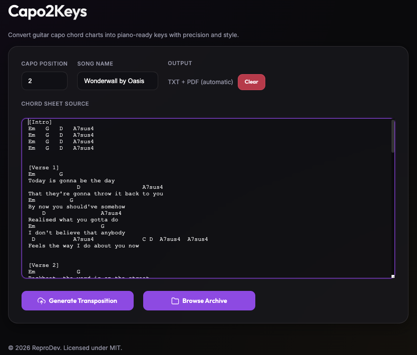
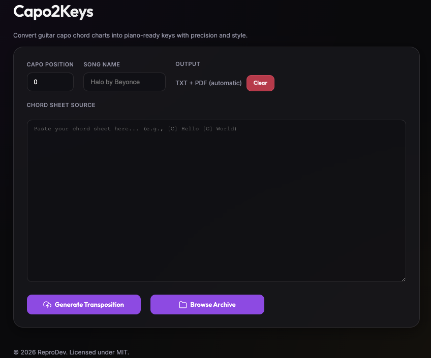
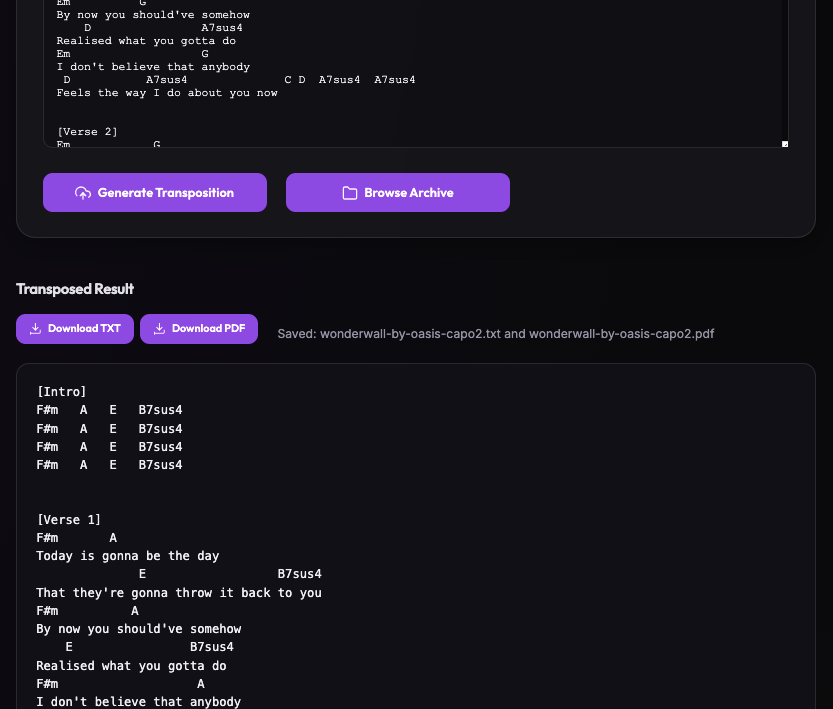
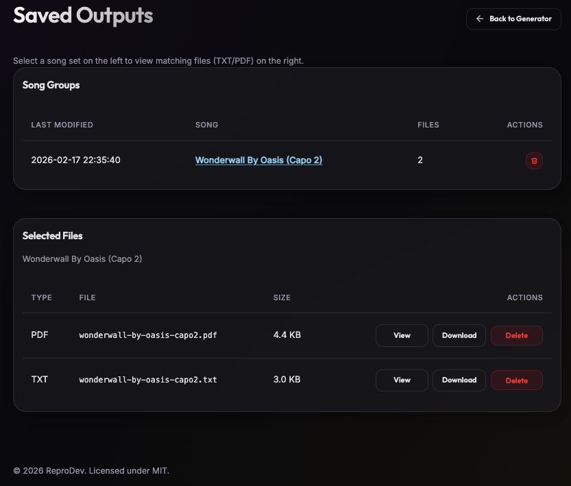
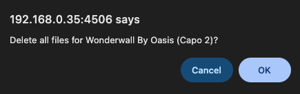
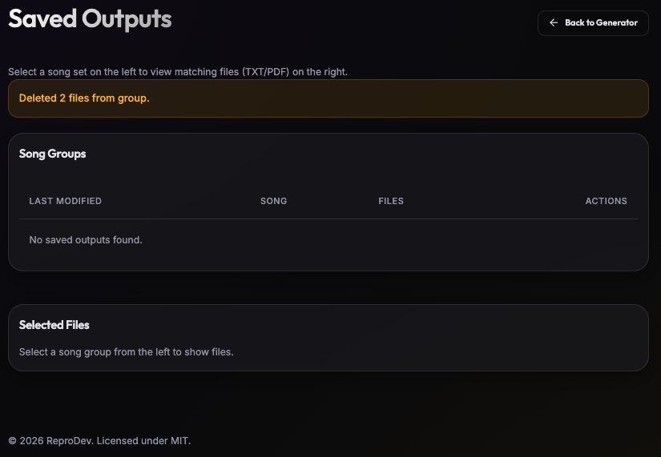

# Capo2Keys

Convert guitar capo chord charts into piano-ready keys while preserving lyrics and chord structure.


Capo2Keys provides a Docker-first Flask WebUI, a CLI mode for scripts, and an optional desktop app build from the same codebase.

## Features

- Transpose by capo value (`0-11` semitones)
- Keep lyrics and chord formatting intact
- Generate both `.txt` and `.pdf` outputs
- Conflict-safe output naming (`suffix` or `overwrite`)
- Archive view grouped by song set
- Docker deployment + GHCR image publishing

## Screenshots

### Generator View



- Pick Your Capo from 0 to 11 (0 to Apply No Capo)
- Fill in the Song Title and Your Artist (Title by Song Artist)
- Copy and Paste your Capo Chords



- Click **Generate Tranpostion** to generate your Guitar Capo Chords tranposed to Piano Chords with all the lyrics
- Download Your PDF or TXT File from here or click **Browse Archive** to view all your generated Piano Chords



---

### Archive View

- Browse the Archive to see your latest tranposed chords or the ones you've prepared earlier



- Each song generates a PDF and TXT file and these are grouped together at the top for easy navigation
- Songs are saved here in the Data folder of the Docker Container where it has been ran or a mounted drive defined in the Docker Compose or Docker Run
- Click the Bin next to each group to download both of the grouped chord sheets



- This archive is now empty but it's ready to be filled up again



---

## Why did I make this?

I took up the piano now just over a few years ago and have played guitar for much longer than that. I loved being able to pick up the guitar with a capo and play songs from Chord sheets on the internet. The main problem was that my music theory was not good enough to be able to easily tranpose these to Piano especially when it has lyrics. I was able to get ChatGPT to tranpose a lot of these for me which I then would convert to PDF manually. It was tedious but worked until it didn't anymore. As we got the end of November, songs were failing to be transposed due to copyright issues with the song lyrics and ChatGPT would choke or just give me one verse.

As I couldn't find anything else out there to do this Capo2Keys (originally named Chordbox and then CapoToKeys) was created. I used Codex in Visual Code Studio to a bit of vibecoding to have this realised as a Docker container that I could spin up when I needed and an accompanying Python application as proof of concept for a Desktop version.

I hope you get as much use out of this as I do and feel free to make suggestions to make this more useful to everyone.

---

## Quick Start (Docker)

```bash
docker build -t capo2keys:local -f dockerfile .

docker run -d \
  --name capo2keys \
  -p 4506:4506 \
  -v "./data:/data" \
  capo2keys:local
```

Open: `http://localhost:4506`

`capo2keys:local` in this section is a local image tag built on your machine.

Outputs are written to `/data/outputs` (mapped to your local volume path).

## Pull From GHCR (No Local Build)

```bash
docker pull ghcr.io/reprodev/capo2keys:latest
docker run -d \
  --name capo2keys \
  -p 4506:4506 \
  -v "./data:/data" \
  ghcr.io/reprodev/capo2keys:latest
```

## Quick Start (GHCR + Compose)

Use the included compose example:

```bash
docker compose -f docker-compose.ghcr.yml up -d
```

Default image reference in that file:

- `ghcr.io/reprodev/capo2keys:latest`

If the package is private, authenticate first:

```bash
docker login ghcr.io -u <github-username>
```

## Image Tags

Published GHCR image format:

- `ghcr.io/<owner>/<repo>:<tag>`

Common tags:

- `latest` (default branch, moving tag)
- `dev` (dev branch)
- `vX.Y.Z` (future release tags)
- `sha-<commit>`

## Configuration

| Variable | Default | Description |
|---|---:|---|
| `DATA_DIR` | `/data` | Base data path (uses `/data/outputs`) |
| `WEB_HOST` | `0.0.0.0` | Flask bind host |
| `WEB_PORT` | `4506` | Flask port |
| `OUTPUT_CONFLICT_MODE` | `suffix` | `suffix` or `overwrite` when file exists |
| `MAX_REQUEST_BYTES` | `1048576` | Maximum HTTP request size |
| `MAX_TEXT_LENGTH` | `200000` | Maximum submitted chord text length |
| `OUTPUT_LIST_LIMIT` | `300` | Max files considered in archive view |
| `PDF_LEFT_MARGIN` | `54` | PDF left margin |
| `PDF_TOP_MARGIN` | `62` | PDF top margin |
| `PDF_BOTTOM_MARGIN` | `54` | PDF bottom margin |
| `PDF_TITLE_SIZE` | `14` | PDF title font size |
| `PDF_BODY_SIZE` | `10` | PDF body font size |
| `PDF_LINE_HEIGHT` | `12` | PDF line height |
| `PDF_MAX_WIDTH_CHARS` | `110` | PDF wrap width |

Production note:

- Set `APP_ENV=production` (or `FLASK_ENV=production`)
- Set `FLASK_SECRET` to a strong non-default value

## CLI Usage

List outputs:

```bash
python entrypoint.py --list
```

Transpose from stdin and save TXT + PDF:

```bash
cat song.txt | python entrypoint.py --capo 1 --title "Song Title" --pdf
```

Overwrite behavior:

```bash
cat song.txt | python entrypoint.py --capo 1 --title "Song Title" --pdf --conflict overwrite
```

## Desktop App (Optional)

Install desktop dependencies:

```bash
pip install -r requirements-desktop.txt
```

Run desktop app:

```bash
python desktop_app.py
```

Build executable:

```bash
pyinstaller --noconfirm --onefile --windowed --name Capo2Keys desktop_app.py
```

## Development

Run tests:

```bash
python -m unittest discover -s tests -v
```

## GitHub Actions

Workflows included:

- `CI`: test matrix and compile checks
- `Docker GHCR`: build and publish container image
- `Desktop Release`: build and attach Windows desktop artifact

GHCR setup details: `docs/GHCR_SETUP.md`

## Project Docs

- `CONTRIBUTING.md`
- `SECURITY.md`
- `docs/PUBLIC_RELEASE_CHECKLIST.md`
- `docs/GHCR_SETUP.md`

## License

MIT — see `LICENSE`.


